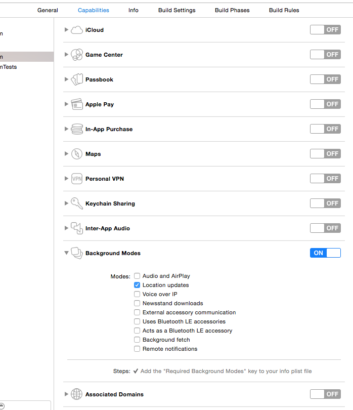
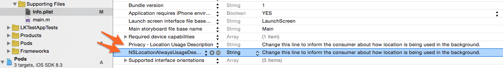

## Obtain an API Key

For now, email [locationkit@socialradar.com](mailto:locationkit@socialradar.com) to request a key until our full developer site is ready.

## Retrieve and integrate the SDK

1. Our team will send you a file named **LocationKit.zip** when you request a key
1. Unzip the file and add the **LocationKit.framework** artifact to your project
1. Using Xcode, navigate to your project target's *General* settings; in the *Linked Frameworks and Libraries* section, add **LocationKit.framework**, as well as **AdSupport.framework**, **CoreLocation.framework** and **MapKit.framework**

## Configure your Project

In the project target's **Capabilities** section, enable **Background Modes** and enable **Location Updates** as shown in the following screenshot:



## Starting and Stopping LocationKit

### Initializing and Starting LocationKit

For example, if you launch your Apple location manager services from within **AppDelegate.m**, add the following line above the **@implementation** section:

```objective_c
#import <LocationKit/LocationKit.h>
```

From within `appdelegate.m`’s `application:didFinishLaunchingWithOptions:` method, add the following lines to initialize and launch LocationKit:

```objective_c
// Initialize and start LocationKit
[LocationKit startWithToken:@"<yourApiTokenHere>"];
```

SocialRadar LocationKit requires the use of the Apple location manager.

Start LocationKit at the point after your app normally begins collecting location data – ideally, it should be run immediately after requesting your user’s permission to access location data and while the app is still in the foreground.

Remember to replace `<yourAPITokenHere>` with the API token supplied to you by SocialRadar.

### Stopping LocationKit

To stop LocationKit from within your code, use the following:

```objective_c
// Stop LocationKit
[LocationKit stop];
```

If you would like to stop LocationKit, you can do so using the class method `stop`.

## Configuring permissions

We recommend the following InfoPlist.strings file configuration (adjust the language as required by your app):

```xml
<?xml version="1.0" encoding="UTF-8"?>
<!DOCTYPE plist PUBLIC "-//Apple//DTD PLIST 1.0//EN" "http://www.apple.com/DTDs/PropertyList-1.0.dtd">
<plist version="1.0">
    <dict>
        <key>NSLocationAlwaysUsageDescription</key>
        <string>Change this line to inform consumer about how location is being used in the background</string>
    </dict>
</plist>
```

Using LocationKit requires the consumer to receive an informational message explaining how location services will be used within the app.

That informational message is contained in the Info.plist or the InfoPlist.strings file.



If your app will run on iOS 7.x, you must add a `NSLocationUsageDescription` entry in addition to the `NSLocationlAlwaysUsageDescription` entry.

If successfully implemented, the consumer will receive a standard location services notification request dialog box presenting them with a request for location services and why the location services are being requested.

If the consumer chooses not to authorize location services, LocationKit will suspend activity until the consumer authorizes location services.

## Ensuring it works

> Place the following code immediately following the LocationKit initialization code to obtain some diagnostic information:

```objective_c
[LocationKit showConfigurationStatus];
```

LocationKit operates in the background, and will not perform heavy operations, nor produce NSNotifications nor NSLogs which may interfere with the performance of your app.

If successful, you will see the following in your console:


Remember to remove these debug lines prior to releasing your app to the App Store!
