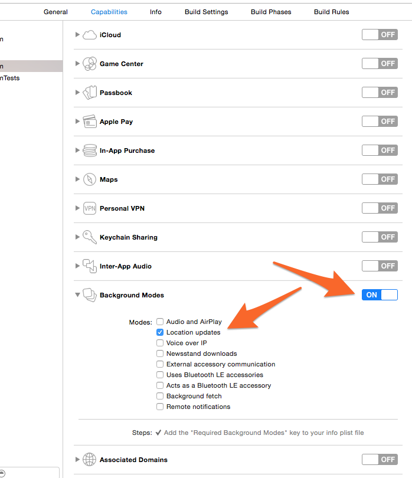
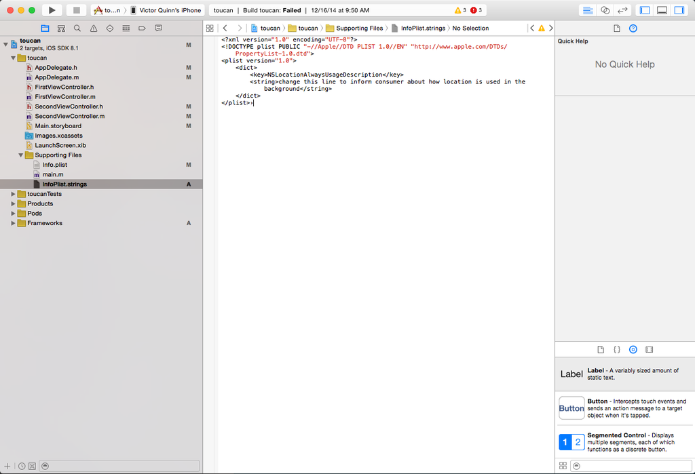

## Setting up

<h3>1. Create an account</h3>

The first thing you'll need to do is to [sign up for an account](http://developer.socialradar.com/#/signup). This will generate your Developer Portal account, and generate your API token.

Within the Developer Portal, you will be able to find your API token, and find insights into the location-based usage of your app with LocationKit.

<h3>2. Install the SDK</h3>

**CocoaPods**

The easiest way to start using LocationKit in your project is by using [CocoaPods](https://cocoapods.org). Just add the following to the Podfile in your project, run `pod install`, and skip to [Configure your project](#configure-your-project):

        pod 'LocationKit', '~> 2.0.0'

**Download LocationKit.framework**

We do not yet have LocationKit available for manual download. If you are unable to use the CocoaPod and need a `.framework`, please contact the LocationKit team at [locationkit@socialradar.com](mailto:locationkit@socialradar.com) and we will send you the file.

<h3>3. Configure your project</h3>

Link to the following libraries to your project:

  | Libraries |
  | - |
  | CoreLocation.framework |
  | MapKit.framework |

**AdSupport (optional)**

Optionally, you can link the `AdSupport.framework` library and, if present, we can use the Apple advertising identifier to identify the device. This is useful particularly if you have other apps or other, more general analytics platforms in which you'd like to cross reference location data your app will gather from LocationKit. Without the AdSupport framework it may not be possible to link data with some of those other sources if you run a report from our Developer Portal.

In the past, Apple has [rejected some apps which use the AdSupport framework](http://techcrunch.com/2014/02/03/apples-latest-crackdown-apps-pulling-the-advertising-identifier-but-not-showing-ads-are-being-rejected-from-app-store/) (particularly the IDFA, the identifier for advertisers) without serving advertisements hence why this framework is optional.

Under the hood, we look to see if this framework is present and use the correct identifier in all cases.

<h3>4. Configure permissions</h3>

Enable **Location Updates** in the allowed **Background Modes**.



Add the following to your Info.plist (adjust the language as required by your app):



*Please note that the key `Privacy - Location Usage Description` autocompletes in Xcode; the key `NSLocationAlwaysUsageDescription` should be added manually.*

If you are using Objective-C, this is it, you're done with setup! [Jump to Control Mechanisms](#control-mechanisms)

<h3>5. Create an Objective-C Bridging Header (Swift-only)</h3>

Since LocationKit is an Objective-C library, you'll need to create an Objective-C bridging header in order to use it with Swift.

1. Create a new Objective-C file to your project  

1. Give it any name you'd like. (e.g. 'Banana') For *File Type*, leave it at its default, Empty File and pick a place in your project to save it  

1. When it prompts you to "configure an Objective-C bridging header" click *Create Bridging Header*  

1. You can then delete the file you just created (e.g. 'Banana.m') but you'll notice a new file created called:  
*{Your Project Name}-Bridging-Header.h*
1. Now import LocationKit in the bridging header file `#import <LocationKit/LocationKit.h>`
1. That's it! You can now use LocationKit in any of your Swift code:  

***

## Control mechanisms

<h3>Initialize and start LocationKit</h3>

Include the LocationKit header in your app to get all the classes:

```objective_c
#import <LocationKit/LocationKit.h>
```

Enable LocationKit with the API token that you obtained earlier:

<h6>Objective-C</h6>
```objective_c
[[LocationKit sharedInstance] startWithApiToken:@"your_api_token" andDelegate:nil];
```

<h6>Swift</h6>
```swift
LocationKit.sharedInstance().startWithApiToken("your_api_token", andDelegate:nil)
```

LocationKit will now start collecting location data.

Optionally you can provide a `LocationKitDelegate` which will receive a constant stream of updates as they come in. Here we have supplied a `nil`. [More on that below.](#streaming-updates)

<h3>Pausing LocationKit</h3>

To pause LocationKit and stop receiving locations and visits, run the following:

<h6>Objective-C</h6>
```objective_c
[[LocationKit sharedInstance] pause];
```

<h6>Swift</h6>
```swift
LocationKit.sharedInstance().pause()
```

Pausing LocationKit will prevent you from receiving any further updates to locations, places, visits, and so on so do so sparingly. It will prevent LocationKit from continuing to run in the background and significantly diminish the usefulness of our location-based developer insights. We strongly recommend not pausing LocationKit.

<h3>Resuming LocationKit</h3>

In order to once again receive updates and get locations or places after you have paused it, you must resume LocationKit as follows:

<h6>Objective-C</h6>
```objective_c
NSError *error = [[LocationKit sharedInstance] resume];
```

<h6>Swift</h6>
```swift
LocationKit.sharedInstance().resume()
```

If there was some issue resuming LocationKit, the error will be non-`nil`

***

## Single Location Requests

<h3>Location Point</h3>

To quickly obtain the user’s most recent location point, execute the following:

<h6>Objective-C</h6>
```objective_c
[[LocationKit sharedInstance] getCurrentLocationWithHandler:^(CLLocation *location, NSError *error) {
    if (error == nil) {
        NSLog(@"%.6f, %.6f, %@", location.coordinate.latitude, location.coordinate.longitude, location.timestamp);
    } else {
        NSLog(@"Error: %@", error);
    }
}];
```

<h6>Swift</h6>
```swift
LocationKit.sharedInstance().getCurrentLocationWithHandler { (location:CLLocation!, error:NSError!) -> Void in
    if let loc = location {
        print("got location (\(loc.coordinate.latitude), \(loc.coordinate.longitude))")
    } else {
        print("got a nil location")
        print("error: %@", error)
    }
}
```

Single point requests do not increase battery consumption rates. Notice this point is simply a `CLLocation` so if your code currently uses the Apple Location Manager, this will return an item in the same format. Here are the [Apple docs on CLLocation](https://developer.apple.com/library/ios/documentation/CoreLocation/Reference/CLLocation_Class/index.html)

You will quickly receive the user's most recent location point to the provided handler.

<h3>Place</h3>

To request the user's current place:

```objective_c
[[LocationKit sharedInstance] getCurrentPlaceWithHandler:^(LKPlace *place, NSError *error) {
    if (error == nil) {
        NSLog(@"The user is in %@", place.address.locality);
    } else {
        NSLog(@"Error fetching place: %@", error);
    }
}];
```

<h6>Swift</h6>
```swift
LocationKit.sharedInstance().getCurrentPlaceWithHandler { (place:LKPlace!, error:NSError!) -> Void in
    if let place = place {
        print("The user is in (\(place.address.locality))")
    } else {
        print("Error fetching place: %@", error)
    }
}
```

This will return an LKPlace object. This place includes data about the user's current location.

An LKPlace object consists of the address for the user's current location along with the venue they are in, if they are at a business. *(see the [Object Model](object-model.md) docs for more details)*

If they are in a place with no address or venue, both will be `nil` so plan your code accordingly. *(Note, currently we only have reliable support and coverage for addresses and venues in the United States.)*

***

## Streaming Updates

In order to receive streaming updates, you must provide an object which conforms to the [LocationKitDelegate](api-reference/#locationkitdelegate) protocol when launching LocationKit. LocationKit will then call the methods on your delegate whenever it detects the device has moved to a new location.

<h3>Location Updates</h3>

As we detect the device moving to a new location and once we receive enough location data from the device to accurately determine the location of the device, we will call `didUpdateLocation` on your delegate.

So your delegate could have a method that looks like:

<h6>Objective-C</h6>
```objective_c
- (void)locationKit:(LocationKit *)locationKit didUpdateLocation:(CLLocation *)location {
    NSLog(@"The user has moved and their location is now (%.6f, %.6f)",
          location.coordinate.latitude,
          location.coordinate.longitude);
}
```

<h6>Swift</h6>
```swift
func locationKit(locationKit: LocationKit!, didUpdateLocation location: CLLocation!) {
    print("The user has moved and their location is now (\(location.coordinate.latitude), \(location.coordinate.longitude))")
}
```

Note, this behaves a bit differently from the Apple Location Manager's `didUpdateLocations`. At a high level, the differences are:

 Apple | LocationKit
 -------|------------
 `didUpdateLocations` receives a constant stream of raw updates as it gets them from the GPS chip | `didUpdateLocation` takes the raw data and filters it to provide a single point with a higher degree of accuracy
 Receives many data points as they come in raw from the GPS chip | Receives fewer, cleaned up and confirmed data points
 Continues to be called constantly, even when the device has not moved | Is called only when a new location is detected by the device. This provides a significant battery optimization as code in this delegate method is executed only when the device is in a new location rather than being constantly executed.
 Receives an array of points, sometimes with a varying degree of accuracy | Receives a single clean point

LocationKit's `didUpdateLocation` will continue to receive location updates while the app is in the background.

If you have any further questions or confusion about this (or anything) please post about it on our [Community](https://community.socialradar.com) and someone from our staff will get back to you ASAP to clarify.

<h3>Visit start</h3>

When we detect a visit has started we will call the `didStartVisit` method on your LocationKitDelegate.

We detect a visit start when we have gathered enough location data to identify:

1. The location of the device
1. That the user is visiting a place

It will receive an LKVisit object which contains information on the time of arrival and the place to which this visit refers. For example:

<h6>Objective-C</h6>
```objective_c
- (void)locationKit:(LocationKit *)locationKit didStartVisit:(LKVisit *)visit {
    NSLog(@"LocationKit detected that a visit started at %@ to %@", visit.arrivalDate, visit.place.venue.name);
}
```

<h6>Swift</h6>
```swift
func locationKit(locationKit: LocationKit!, didStartVisit visit: LKVisit) {
    if let arrival = visit.arrivalDate {
        print("visit started at %@", arrival)
    }
    print("in zip code \(visit.place.address.postalCode)")

    // Some places have a venue, some do not.
    if let venue = visit.place.venue {
        print("at venue named \(venue.name)")
    }
}
```

Note, an LKVisit also has a property called `departureDate` which of course would be `nil` for in `didStartVisit` (because without a crystal ball we cannot determine when the user will leave at the time they arrive!).

<h3>Visit end</h3>

When we detect that a visit to a place has ended, we will call the `didEndVisit` method on your delegate.

We are constantly tweaking the criteria to determine that a visit has ended, so this may change slightly, but generally we determine that a visit has ended when:

1. We detect that another visit has started or
1. We detect that the device has moved far enough away from the place that they are no longer there.

This delegate method will receive an LKVisit object which contains information about the time of arrival, departure, and the place to which that visit refers. For example:

<h6>Objective-C</h6>
```objective_c
- (void)locationKit:(LocationKit *)locationKit didEndVisit:(LKVisit *)visit {
    NSLog(@"LocationKit detected that a visit occurred from %@ to %@ at %@",
          visit.arrivalDate,
          visit.departureDate,
          visit.place.venue.name);
}
```

<h6>Swift</h6>
```swift
func locationKit(locationKit: LocationKit!, didEndVisit visit: LKVisit) {
    if let departure = visit.departureDate {
        print("visit ended at %@", departure)
    }
    print("in zip code \(visit.place.address.postalCode)")

    // Some places have a venue, some do not.
    if let venue = visit.place.venue {
        print("at venue named \(venue.name)")
    }
}
```

***
